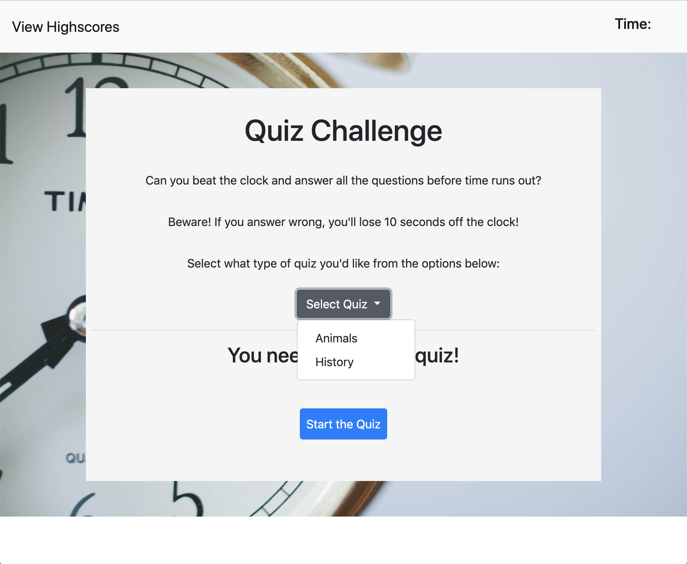
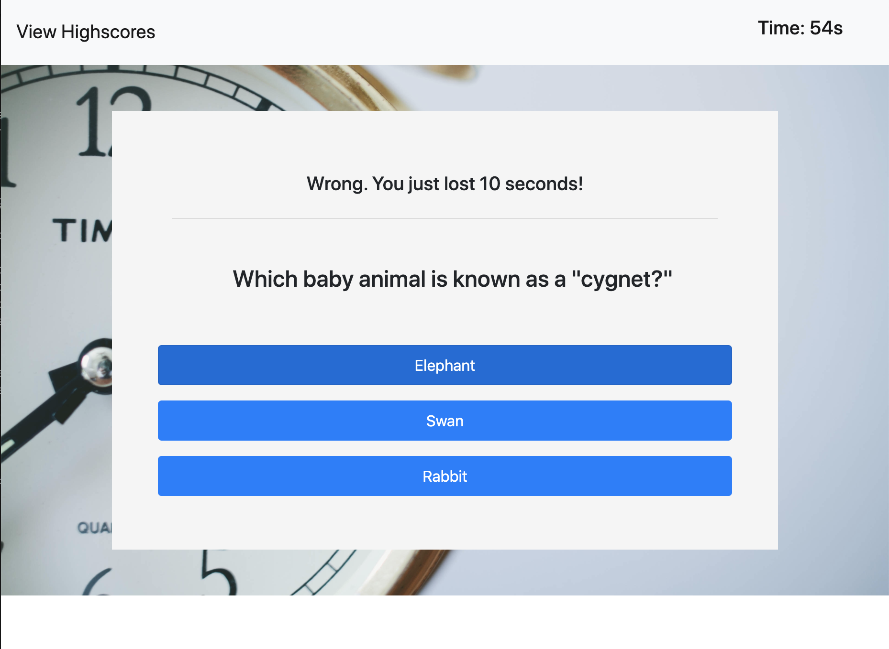
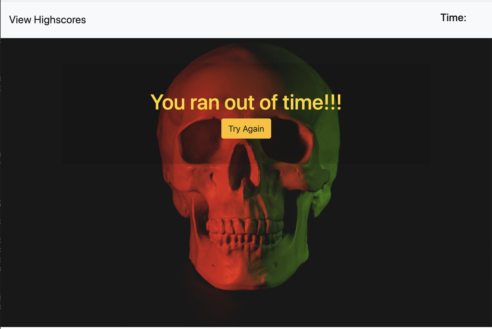
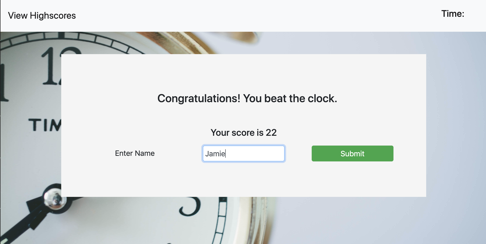
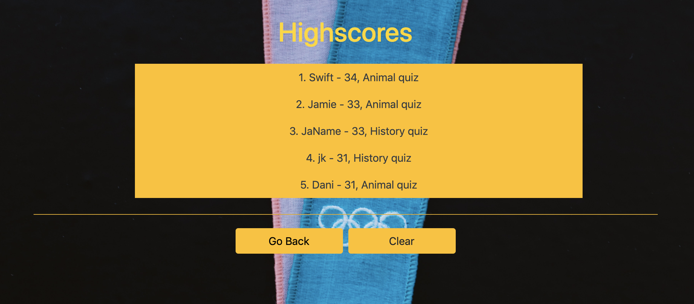

# TimedQuiz

This web application functions as a timed quiz, testing users' knowledge of either animals or US history/geography.

## Installation

Clone folder onto your own computer by forking the repository and using the "Clone or download" button on github.  

## Usage Example

Upon loading the page, the user is directed to select a quiz type from the dropdown menu of options. Once a quiz is selected, they can then begin the quiz by clicking the start button. Users can also access the Highscore page from the landing page, by clicking on the link in the upper left hand corner of the page. 

When the user starts the quiz by clicking on the start button, a 75 second timer will begin. The user can access time left to complete the quiz by looking at the display in the upper right hand corner of the page. The selected quiz questions will populate the screen, replacing the html of the landing page. Each answer button is created with event listeners that when clicked, will generate the next quiz question. The answer will also generate either a correct or incorrect message and corresponding audio. If the user selects the wrong answer, a 10 second penatly will be taken from the time left to complete the quiz. 

If the time runs out before the user is able to finish all the questions, they will be directed to a gameover image and the timer will clear. They have the option to retry to the quiz by clicking on the button. 

If they do complete the questions before the timer runs out, the application will generate a form where the user can input their name and view their score. On clicking onto the submission form, the correct/incorrect message from the last question will disappear. Once they submit their name, they will be redirected to the highscores page. Input is saved in a stringified array on local storage. 

The highscore page displays 5 highest scores in order of highest score to lowest. Scores are accesed from local storage. They are displayed along with the user's name and the quiz type. Users are given the option to clear all saved scores from both local storage and the display by clicking the "clear" button. They can also retry the quiz using the "go back" button. 

## Coding

This project utilizes javascript and css. Bootstraps 4 was also utilized for the styling and for media responsiveness. Local storage was used to save high score data between pages of the project. 

## Meta 

Jamie Kook - kookjc6@gmail.com

[https://https://jamiekook.github.io/TimedQuiz/](https://jamiekook.github.io/TimedQuiz/)

Animal questions taken from [https://www.factmonster.com/take-quiz/animals1](https://www.factmonster.com/take-quiz/animals1)

History questions taken from [https://www.britannica.com/quiz/all-american-history-quiz](https://www.britannica.com/quiz/all-american-history-quiz)
